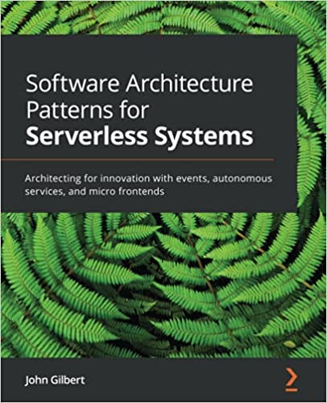

# templates

This repository contains the templates that I reference in my book:

[Architectural Patterns for Serverless Systems](https://www.amazon.com/Software-Architecture-Patterns-Serverless-Systems/dp/1800207034)

## Seeding from templates
1. Copy a given template folder
2. Replace text "my" with your system name prefix
3. Replace text "template" with your subsystem name prefix
4. Replace text "thing" and "Thing" with an appropriate domain entity name
5. Uncomment need yaml fragments
6. Delete unneeded files

## Scripts
* `npm ci`
* `npm test`
* `npm run test:sls`
* `npm run test:int`
* `npm run dp:np:w`
* `npm run dp:np:e`
* `npm run dp:prd:w`
* `npm run dp:prd:e`

## Developer Setup
1. Install:
   - [Git](https://git-scm.com/downloads)
   - [NVM](https://github.com/nvm-sh/nvm)
   - [VSCode](https://code.visualstudio.com/download)
2. Setup credentials locally

## References
* [AWS Credentials](https://www.npmjs.com/package/aws-get-session-token)
* [SLS Credentials](https://www.serverless.com/framework/docs/providers/aws/guide/credentials)
* [GitLab CI](https://docs.gitlab.com/ee/ci)
* [npm scripts](https://docs.npmjs.com/misc/scripts)
* [Serverless Framework](https://serverless.com/framework/docs/providers/aws)
* [CloudFormation Service Role](https://docs.aws.amazon.com/AWSCloudFormation/latest/UserGuide/using-iam-servicerole.html)
